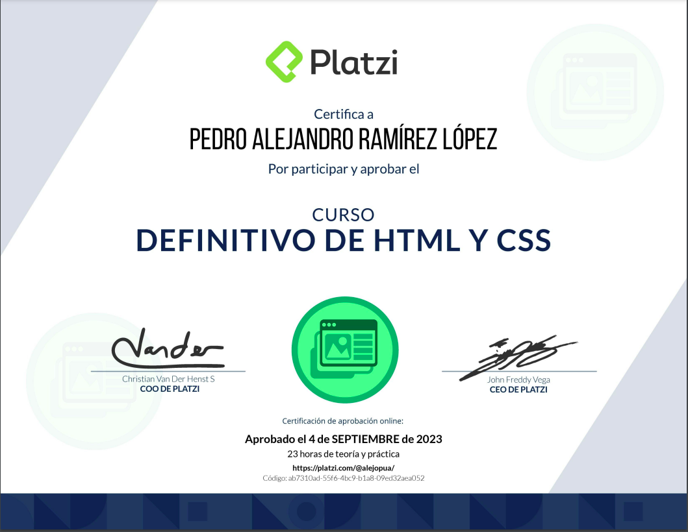

<h1 align="center">HTML & CSS</h1>

The repository contains specific code related to the above topics. In addition, I invite you, if you find a topic that does not have associated code, to make a pull request (PR) to add it. Remember that learning to program involves constant practice and research. Never stop learning and don't let anything hinder your dreams.

# Perfiles de un Desarrollador Web

Este README presenta una visión general de los perfiles de un desarrollador web, destacando las especializaciones en Frontend, Backend y FullStack, junto con las tecnologías y herramientas asociadas.

## Frontend

This is the developer who handles the visual aspect, the client-side (browser) part.

- Interactions
- Animations
- Styles
- Navigation

### Standards Managed by a Frontend Developer

- HTML
- CSS
- JavaScript

### Frameworks CSS

Frameworks help us in building our project by providing pre-written code snippets to expedite product creation. Some of them include:

- Bootstrap
- Tailwind CSS
- Foundation

### Frameworks y Bibliotecas JavaScript
These are tools that allow us to scale our project to production more quickly and with greater interactivity. Some of them are:

- React
- Angular
- Vue

### Preprocesadores CSS
It's a different way of writing CSS. Some call it "CSS with superpowers."

- Less
- Stylus
- Sass

### Compiladores y Empaquetadores
These programs enable us to use the latest versions of JavaScript (it's always a good practice to use the latest JS versions) through a compilation process for the browser to understand.

- Babel
- Webpack

## Backend

The Backend Developer works on the server side, managing the logic behind the application:

- Implement application logic.
- Manage databases and data storage.
- Manage authentication and security.

### Programming Languages

- Python
- Node.js
- PHP
- Ruby
- Go
- Java
- .Net

### Frameworks

- Django (Python)
- Laravel (PHP)
- Rails (Ruby)
- Express (Node.js)
- Spring (Java)

### Infrastructure

Cloud infrastructure is essential for deployment:

- Google Cloud
- Digital Ocean
- AWS
- Heroku

### Databases

- MongoDB
- MySQL
- PostgreSQL

## FullStack

- A full-stack developer combines various tools and knowledge from both frontend and backend development. They work with libraries, frameworks, and programming languages. A full-stack developer doesn't know everything 100%.

***A FullStack developer understands the whole process, but does not necessarily know everything.***

### **HTML**
- Introduction to HTML.
- Anatomy of a webpage.
- Structure.
- HTML Elements and Tags.
- Web Documentation.
- Indentation.
- Images.
- Links.
- Ordered and Unordered Lists.
- Text Formatting.
- Forms.
- Buttons and Checkboxes.
- 
 Elements.
- <head> Elements.
- Footer.
- HTML Semantics.

### **CSS**
- Introduction to CSS.
- Inline Styles, <style> Block, and CSS Files.
- Pseudo-classes and Pseudo-elements.
- Box Model.
- Inheritance.
- Specificity in Selectors.
- Combinators.
- Text Formatting (size, font type, backups).
- Attribute Selectors.
- Absolute and Relative Units.
- HEX and RGB Colors in CSS.
- CSS Variables.
- Position.
- Display.

### **Responsive Design**
- Introducción a Responsive Design.
- Media Queries.
- Viewport.
- Mobile First.
- Mostly Fluid.
- Layout shifter.
- Column Drop.

### 🤝 Contributing

Contributions are what make the open source community such an amazing place to be learn, inspire, and create. Any contributions you make are **extremely appreciated**.

1. Fork the Project
2. Create your Feature Branch (`git checkout -b feature/AmazingFeature`)
3. Commit your Changes (`git commit -m 'Add some AmazingFeature'`)
4. Push to the Branch (`git push origin feature/AmazingFeature`)
5. Open a Pull Request

### Built With

Technologies used in the project.
* HTLM 5
* CSS 3

<!-- CONTACT -->
### 📫 Contact   me

 
  
  
   

<!-- ACKNOWLEDGEMENTS -->
### Acknowledgements
* Platzi

<h1 align="center" >🏆 Certification🏆
</h1>

